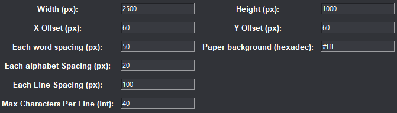

# Python Glyph2Text transformer 🧙‍♂️
Hello! This is a silly project made by mine! What this Python script does is simply convert an equivalent character and an image, combining them and turning them into a complete image! *ok maybe i explain it too badly, but I'll show you how.*


## ⁉ What's Inside?
- **Images:** This is where each character are being represente as it's image. Example, the character 'A' may looks like an image with a snake! Btw, this is configurable! As soon as it started with '_' and the character '_A' and it is an image format.

- **Glyph2Text transformer:** This one is the script where the text will be transformed to an Image. 

## 🚀 How to Use?
It's really easy to use. 

1. You should have your `Images` folder prepared in the current directory where the Python script exist. Example, if the Python script exist in `source/app`, then the `Images` folder and the `run.pyw (the python script)` should exist in that directory.

2. Your `Images` folder should have an equivalent character with it's image. And each should have this `_[character].png`, example `_B.png`. And, if you want to use a different one, you can use the one that I prepared called `Images.alt`, to use it simply remove the `.alt` :D.
**IMPORTANT:** DO NOT RENAME THE `Images` FOLDER. OR ELSE IT WILL NOT WORK. SINCE THE PYTHON SCRIPT ONLY RECOGNIZE THE `Images` FOLDER.

4. If these 2 steps are complete, you can start off by run the `run.pyw`. It should be like this.


5. If you're done, then nice! You can start by typing random things, and eventually the program will convert it for you. Incase you're still reading this, you can actually configure the paper's width & height, character's spacing, and etc.


Each variables represent below:
```
Width: px = The width of the paper (default: 2500)
Height: px = The height of the paper (default: 1000)
Each word spacing: px = The distance between each word. (default:50) (example: 'my mom' with 'my    mom')
Each alphabet spacing: px = The distance between each character (default: 20) (example: 'my' with 'm  y')
Each line spacing: px = The distance between previous line with new line. (default: 100)
Max characters per line: int = How many characters for each line. (default: 40)
Paper background: hexadecimal = The color of the paper's background (default: #fff)
```

## 📜 Instructions:
1. **Clone the repository:**
```bash
git clone https://github.com/DaemonPooling/Glyph2Text-transformer.git
```

2. **Navigate to the Project Folder:**
```bash
cd Glyph2Text-transformer
```

3. **Install Dependencies:**
```bash
pip install -r requirements.txt
```

4. **Locate through source directory:**
```bash
cd source
```

5. **Run run.pyw:**
```bash
python run.pyw
```
